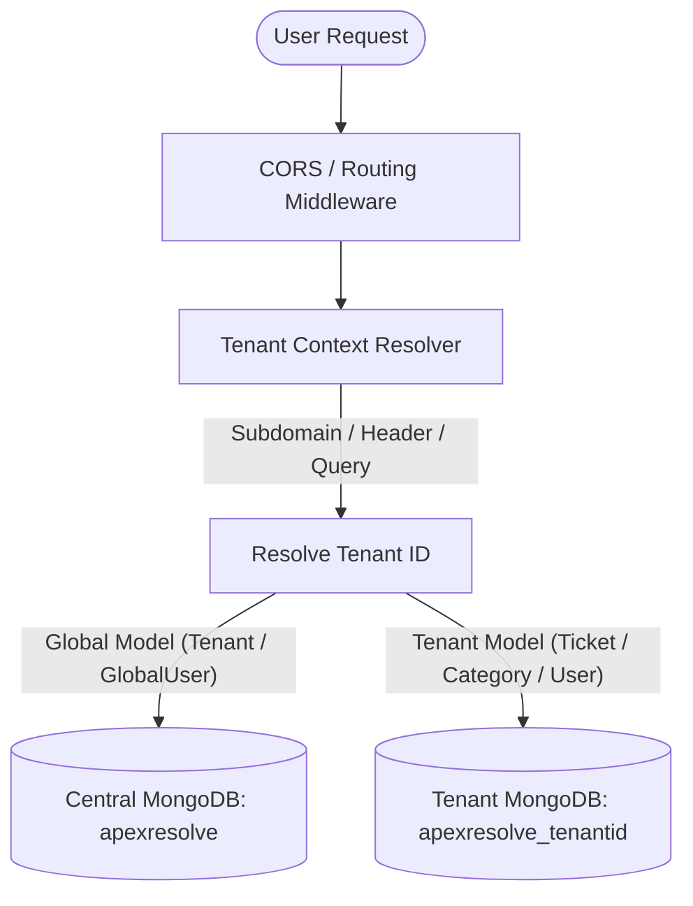

# ApexResolve Administrator Guide

Welcome to the **ApexResolve Complaint & Case Management System** administration documentation. This guide provides a detailed look at the core architecture, configuration options, and administrative features of ApexResolve.

---

## Table of Contents
1. [Multi-Tenant Database Architecture](#1-multi-tenant-database-architecture)
2. [Business Calendars & SLA Engine](#2-business-calendars-sla-engine)
3. [AI Classification & Smart Routing](#3-ai-classification-smart-routing)
4. [Duplicate Detection & Impact Scoring](#4-duplicate-detection-impact-scoring)
5. [Workload Balancing & Auto-Assignment](#5-workload-balancing-auto-assignment)
6. [Workflow Designer & Custom Metadata](#6-workflow-designer-custom-metadata)
7. [Integrations & Developer Webhooks](#7-integrations-developer-webhooks)

---

## 1. Multi-Tenant Database Architecture

ApexResolve uses a highly scalable, secure, and isolated **database-per-tenant multi-tenancy** model. This enforces complete data segregation at the database level while utilizing a single deployment for the API server and frontend application.



### Context Resolution Flow
On every incoming HTTP request, the [tenantMiddleware](file:///c:/Users/gamer/Downloads/CMS/CMS/backend/middleware/tenantMiddleware.js) resolves the active organization workspace using the following priority queue:
1. **HTTP Headers**: Look for a custom `x-tenant-id` header.
2. **Query Parameters**: Inspect the request URL for `?tenantId=...`.
3. **Subdomain Resolution**:
   - Local development: Matches subdomains on localhost (e.g. `acme.localhost` resolves to `acme`).
   - Render environments: Automatically handles subdomains on Render default hosts (`*.onrender.com`).
   - Custom domains: Extracts the top-level subdomain of custom domains (e.g. `customer1.apexresolve.com` resolves to `customer1`).

If no tenant identifier is matched, the context defaults to `default-tenant`.

### Database Partitioning & Schemas
ApexResolve models fall into two categories:
* **Global Models**: Stored centrally in the primary `apexresolve` database. These schemas are configured with `bypassTenantPlugin: true` and `globalModel: true`.
  - [Tenant](file:///c:/Users/gamer/Downloads/CMS/CMS/backend/models/Tenant.js): Holds branding, name, custom domains, and subdomain maps.
  - [GlobalUser](file:///c:/Users/gamer/Downloads/CMS/CMS/backend/models/GlobalUser.js): Maps registered emails to their registered tenant workspaces, allowing domain routing at login.
* **Tenant-Scoped Models**: Shared schema definitions dynamically mounted to database `apexresolve_<tenantId>` at runtime.
  - Examples: `User`, `Ticket`, `Category`, `SlaConfiguration`, `BusinessCalendar`, `FieldDefinition`.
  - Uniqueness constraints (e.g., categories names) are automatically converted on startup from single-field indexes to compound indexes combining `[tenantId, field]` to prevent collisions.

---

## 2. Business Calendars & SLA Engine

The SLA engine computes two distinct dates for each incident: the **Response Due At** (time limit to acknowledge the issue) and the **Resolution Due At** (time limit to resolve the issue). 

Calculations are computed dynamically in business time using the [calendarService](file:///c:/Users/gamer/Downloads/CMS/CMS/backend/services/calendarService.js).

### Business Calendar Configuration
Each tenant can configure multiple custom calendars, with one marked as default. Calendars define:
* **TimeZone**: Timezone used for checking hours (utilizing native standard JS timezone conversions via `Intl.DateTimeFormat`).
* **Working Days**: A set of weekdays (e.g., Monday through Friday).
* **Working Hours**: Standard daily start and end times (e.g., `09:00` to `17:00`).
* **Holidays**: 
  - *Standard Holidays*: Single-date exclusions (e.g., Christmas 2026).
  - *Recurring Holidays*: Annual recurring dates where the year part is ignored.
* **Exceptions**: Custom work hours defined for a specific day (e.g., half-day, extended shifts).
* **Blackout Periods**: Complete system freezes where SLA timers are globally paused for affected calendars.

### Dynamic SLA Resolution Cascade
When a ticket is created or updated, the system resolves which calendar to apply by evaluating:
1. **Ticket Calendar**: Directly overridden calendar on the ticket.
2. **Escalation Workflow**: Calendar mapped to the active escalation rule.
3. **Category Calendar**: Calendar mapped to the ticket category.
4. **Department Calendar**: Calendar mapped to the owning department.
5. **Default Calendar**: Fallback to the organization's default Business Calendar.

### Maintenance Windows Scoping
Admins can declare **Maintenance Windows** that freeze SLA calculations. Unlike blackout periods, maintenance windows support **Department Scoping**:
* If `affectedDepartments` is configured for a window, SLA timers are only paused for tickets routed to those specific departments.
* Other departments continue to run SLA timers normally during the window.

```mermaid
gantt
    title SLA Due Date Calculation Timeline
    dateFormat  HH:mm
    axisFormat %H:%M
    section Business Hours
    09:00 - 17:00 Work Period :active, 09:00, 8h
    section Maintenance Window
    SLA Timers Paused :crit, 11:00, 2h
    section Final Calculation
    SLA Target (6 Hours) :after active, 09:00, 8h
```



### SLA Targets, Risk Scores, and Escalations
Under the SLA configuration panel, administrators can:
* Define Response and Resolution thresholds (in minutes) for priorities: `Critical`, `High`, `Medium`, and `Low`.
* Set **Risk Score Rules**: Automatically calculates a dynamic ticket risk score based on events (e.g. response breach = +10, low CSAT rating = +15).
* Customize **Multi-Breach Actions**: Progressive escalations triggered as breach counts accumulate:
  - 1st breach: Notification dispatched to supervisor.
  - 2nd breach: Automated priority upgrade.
  - 3rd breach: Notification sent to department head.
  - 4th breach: Executive escalation alert.
  - 5th breach: Incident flagged as a critical site event.

---

## 3. AI Classification & Smart Routing

ApexResolve integrates with **Google Gemini** LLMs to automatically classify and route incoming complaints, removing the need for citizen triage.

### Classification Flow
1. Citizen fills out a basic incident summary and details.
2. The system packages the text and passes it to the active AI prompt.
3. The LLM returns a structured JSON predicting:
   - The target **Department** (with confidence score & explanation).
   - The target **Category** (with confidence score & explanation).
4. If the confidence scores exceed the configured **Auto-Accept Threshold**, the fields are auto-populated.
5. If the scores fall between the **Auto-Accept** and the **Suggestion Threshold**, suggestions are shown as options.
6. Below the suggestion threshold, the system reverts to manual selection.

### Versioning & Safety Rollbacks
To prevent production routing issues when adjusting system instructions, prompt administration is fully versioned:
* All prompts (System, Classification, Fallback, Reasoning) are stored as distinct versioned records in `AiPrompt`.
* When an administrator edits a prompt, a new version is created and immediately set active.
* Admins can rollback to any previous version with a single click.
* Every update or rollback action writes a configuration audit entry in the `AiConfigAuditLog`.

```
Active Version: V4 (Optimized for IT Assets)
---------------------------------------------
[Rollback to V3]  |  [Rollback to V2]  |  [Rollback to V1]
```

### Fail-Safe Safeguards
* **Caching**: Suggested classifications are cached in-memory based on text similarity to minimize external API costs.
* **Failsafe Mode**: If the LLM times out or returns an error, the system automatically falls back to manual entry.
* **Telemetry & Logs**: Real-time charts track success rate, API latencies, error types (timeout vs. API errors), and override rates (how often staff manually change AI-assigned fields).

---

## 4. Duplicate Detection & Impact Scoring

To prevent incident backlogs from duplicate submissions during outages, ApexResolve includes a duplicate prevention engine.

### Live Duplicate Checks
When a citizen begins typing an incident title or description, the system performs a real-time similarity check against active, open tickets in the same department/category. If potential duplicates are found, the citizen is prompted to view the open issues.

### Citizen "Support" & Impact Scoring
Instead of opening a new ticket, a citizen can **Join/Support** an existing ticket:
* This registers the user as a supporter on the master ticket.
* The system computes a dynamic **Impact Score** representing user pressure:
  $$\text{Impact Score} = \text{Supporter Count} \times \text{Severity Weight} \times \text{Category Weight}$$

| Dimension | Option / Keywords | Weight |
|---|---|---|
| **Severity Weight** | Low / Medium / High / Critical | 1 / 2 / 3 / 4 |
| **Category Weight** | Outage, Leakage, Failure, Repair | 2.0 |
| **Category Weight** | Discrepancy, Refund | 1.5 |
| **Category Weight** | General | 1.0 |

### Auto-Escalation Thresholds
As citizens join a ticket, the system automatically upgrades its priority to elevate visibility:
* **10+ Supporters**: Upgrades priority to **Medium**.
* **25+ Supporters**: Upgrades priority to **High**.
* **50+ Supporters**: Upgrades priority to **Critical**.

*Note: Triggering an auto-upgrade automatically recalculates the SLA deadlines and resets the escalation timers.*

### Merge Controls
Admins can manually merge multiple tickets into a master ticket:
* Targets are marked `Closed` with closure type `Auto Closed` and linked via `parentTicketId`.
* All comments, attachments, history logs, and unique supporters are merged into the master ticket.
* Comments merged from duplicates are prefixed with `[Merged from CMS-XXXX]`.
* The master's impact score and priority are recalculated based on the combined supporters.

---

## 5. Workload Balancing & Auto-Assignment

To ensure fair ticket distribution, the system features a capacity-aware auto-assignment engine.

### Workload Score calculation
Each admin is assigned a dynamic **Workload Score** based on their active ticket burden:
* **Priority Weights**: Low = +1, Medium = +2, High = +3, Critical = +5.
* **Critical Ticket Penalty**: +2 points per critical ticket.
* **Immediate SLA Risk**: +3 points if a ticket is within 24 hours of breach; +5 points if under 2 hours.
* **Escalation Risk**: +3 points if a ticket is within 24 hours of escalation; +5 points if under 2 hours.

$$\text{Capacity Utilization \%} = \left( \frac{\text{Workload Score}}{\text{Max Capacity}} \right) \times 100$$

Admins can customize each staff member's `Max Capacity` and availability status (`Available`, `Busy`, `On Leave`, `Unavailable`).

### Auto-Assignment Strategies
When an incident is routed to a department, the system evaluates eligible available staff using the configured strategy:
1. **Workload-Based**: Assigns the ticket to the agent with the lowest Workload Score.
2. **Least Tickets**: Assigns to the agent with the lowest count of open tickets.
3. **Round-Robin**: Rotates assignments sequentially using in-memory pointers.
4. **Skill-Based**: Filters agents matching skills related to the ticket category, falling back to Least Tickets.

### Workload Leveling Suggestions
The dashboard scans staff metrics to suggest optimization changes:
* **Overloaded Alerts**: Triggers when an agent's capacity utilization exceeds **90%**, critical tickets $\ge$ 3, or SLA risk tickets $\ge$ 2.
* **Balancing Suggestions**: Recommends transferring high-weight tickets from overloaded agents ($>90\%$) to underloaded colleagues ($\le 75\%$).

---

## 6. Workflow Designer & Custom Metadata

Administrators can design custom lifecycles and data collection requirements for each category.

### Node-Based Workflow Builder
Admins can map states and transitions per category:
* **System-Reserved States**: Workflows must contain `Pending`, `Awaiting Feedback`, `Closed`, and `Reopen Requested` to ensure compatibility with standard system triggers.
* **Custom States**: Admins can add intermediate states (e.g. `In Review`, `Lab Testing`, `Parts Ordered`).
* **Transitions**: Define valid paths from State A to State B.
  - *Allowed Roles*: Restrict transition buttons to `citizen`, `admin`, or `any`.
  - *Auto-Routing*: Set automated department routing on transition.
  - *Escalation Overrides*: Configure target completion hours for specific transitions.
* *Validation Safeguard*: Admins cannot delete a workflow state if there are open tickets currently in that state.

```
[Pending] ──(Start Investigation)──> [In Review] ──(Resolve)──> [Awaiting Feedback] ──(Close)──> [Closed]
```

### Custom Field Registry
Using the metadata registry, admins can attach custom fields to tickets, services, or assets:
* **Supported Field Types**: Text, number, currency, date, user reference, select dropdowns, attachments, and math formulas.
* **Display Rules**: Configure conditional field visibility using operators (`eq`, `ne`, `gt`, `in`, etc.) based on other field values.
* **Validation Rules**: Set custom error messages and regex match criteria for inputs.

---

## 7. Integrations & Developer Webhooks

Administrators can integrate ApexResolve with external IT and notification systems.

```
[System Event] ──> [Payload Assembly] ──> [Secret Signing] ──> [HTTP POST] ──> [Subscriber URL]
```

### Supported Events
Subscribers can register for specific system actions:
* `ticket.created`: Dispatched when an incident is opened.
* `ticket.updated`: Dispatched when status, priority, or assignees change.
* `ticket.sla_breached`: Dispatched when SLA response or resolution timers expire.
* `ticket.comment_added`: Dispatched when customer or staff add messages.
* `webhook.test`: Custom diagnostic event.

### Security Signatures
Webhooks support an optional custom secret key. If configured:
* The system computes an HMAC SHA256 signature of the payload using the secret key.
* The signature is transmitted in the `X-Hub-Signature-256` request header, enabling destination servers to verify payload authenticity.

### Debugging & Test Dispatch
Administrators can test custom webhook integrations from the admin panel:
* Click **Test Connection** on any webhook configuration.
* The system generates a realistic mock payload matching standard ticket schemas and dispatches it immediately.
* Return status codes and payload delivery success details are displayed in real-time.
