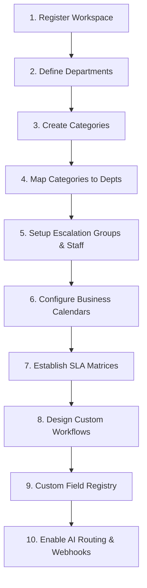

# Getting Started with ApexResolve: Onboarding & Setup Guide

Welcome to **ApexResolve**! This guide takes you step-by-step through configuring your workspace from scratch. Follow this recommended sequence to set up departments, categories, staff, calendars, SLAs, custom workflows, and AI routing.

---

## The Onboarding Map

---

## Step 1: Register and Initialize Your Workspace

Before your staff can log in, you must initialize your organization's tenant workspace.

1. Navigate to the ApexResolve main portal.
2. Select **Register Tenant** (or go to `/register-tenant` in your browser).
3. Fill in your **Organization Name** and choose a unique **Subdomain** (e.g., `acme`).
4. Enter the administrator credentials. This user will have Super Admin access.
5. Submit the registration. You will be redirected to your dedicated tenant subdomain login page: `http://acme.localhost:5173/login` (in development) or `https://acme.yourdomain.com/login` (in production).
6. Log in with your admin credentials.

---

## Step 2: Define Your Departments

Departments own and resolve complaints. Set up your departments before categories or staff.

1. Navigate to **Settings Hub** $\rightarrow$ **Departments** in the sidebar.
2. Click **Create Department**.
3. Name your department (e.g., `Facilities & Infrastructure`, `IT Service Desk`, `Human Resources`).
4. Provide a description so users know what types of incidents this department handles.
5. Set the status to **Active** and click **Save**.

---

## Step 3: Create Service & Complaint Categories

Categories organize incident types (e.g., *Power Failure*, *Software Install*, *Network Outage*).

1. Navigate to **Settings Hub** $\rightarrow$ **Categories**.
2. Click **Add Category**.
3. Provide a name and detailed description.
4. Select the **Ticket Types** that can use this category (e.g., select *Incident* and *Complaint*).
5. Click **Save**.

---

## Step 4: Map Categories to Departments

Once you have created departments and categories, link them to ensure that incoming tickets are routed to the correct department.

1. Navigate to **Settings Hub** $\rightarrow$ **Department Category Mapping**.
2. Click **Add Mapping**.
3. Select a **Department** (e.g., `IT Service Desk`).
4. Select a **Category** (e.g., `IT Software`).
5. Set to **Active** and click **Save**. 

*Any ticket filed under "IT Software" will now be automatically assigned to the "IT Service Desk" department.*

---

## Step 5: Invite Staff & Create Escalation Groups

Now, add your staff and organize them into groups.

### A. Create Escalation Groups
1. Navigate to **Settings Hub** $\rightarrow$ **Group Management**.
2. Click **Create Group**.
3. Enter a group name (e.g., `Network Support Tier 1`, `Facilities Repairs`).
4. Link the group to a **Department** (e.g., `IT Support`).
5. (Optional) Assign a Group Leader and a Backup Leader. Click **Save**.

### B. Add Staff Users
1. Navigate to **Settings Hub** $\rightarrow$ **Staff Management**.
2. Click **Invite Staff** or **Create User**.
3. Enter their name, email, and choose their role (**Admin**).
4. Under **Group Memberships**, assign them to their respective escalation groups (created in the previous step).
5. Assign their **Escalation Role** (e.g. `agent`, `lead`, `manager`, `director`).
6. Set their **Max Capacity** (default is 20). This capacity limit is used by the auto-assignment engine.
7. Click **Save**.

---

## Step 6: Configure Business Calendars

Business calendars ensure SLA deadlines are calculated only during working hours.

1. Navigate to **Settings Hub** $\rightarrow$ **Business Calendars**.
2. A default calendar is seeded on startup. You can edit this calendar or click **Create Calendar** to make a new one.
3. Set your operational **TimeZone** (e.g., `Asia/Kolkata` or `America/New_York`).
4. Check your active **Working Days** (e.g., Monday through Friday).
5. Input your daily **Working Hours** (e.g., `09:00` to `17:00`).
6. Add your annual company **Holidays** (support standard and recurring options).
7. If your support team has exceptions (e.g., half-days or weekend shifts), add them in the **Exceptions** tab.
8. Click **Save**.

---

## Step 7: Establish SLA Targets & Matrices

SLA matrices define the response and resolution target times for each priority level.

1. Navigate to **Settings Hub** $\rightarrow$ **SLA Settings**.
2. Click **Create SLA Matrix** or edit the seeded *Standard Enterprise SLA*.
3. For each priority (`Critical`, `High`, `Medium`, `Low`), input the target **Response Minutes** and **Resolution Minutes**.
4. Under **Breach Actions**, select what happens when a timer expires (e.g. `NOTIFY_ASSIGNED`, `NOTIFY_MANAGER`, `PRIORITY_UPGRADE`).
5. Under **Multi-Breach Rules**, customize progressive actions as breaches pile up (e.g. escalate to director after 4 breaches).
6. Toggle **Is Default** if this is your primary organization SLA, and click **Save**.

---

## Step 8: Design Custom Lifecycle Workflows

Workflows govern the status changes of your tickets.

1. Navigate to **Settings Hub** $\rightarrow$ **Workflow Designer**.
2. Click **Create Workflow**.
3. Select the **Category** this workflow applies to.
4. Define the workflow **States**:
   - Make sure your workflow includes the system-reserved states: `Pending`, `Awaiting Feedback`, `Closed`, and `Reopen Requested`.
   - Add custom states (e.g., `Parts Ordered`, `Awaiting Vendor`).
5. Map **Transitions** between states:
   - Provide a label (e.g. "Resolve Issue").
   - Define the **Allowed Role** who can click the button (`admin`, `citizen`, or `any`).
   - Define auto-routing and completion target hours for each transition step.
6. Click **Save**.

---

## Step 9: Add Custom Fields (Metadata Registry)

Collect specific information for different categories (e.g., ask for *MAC Address* for IT hardware tickets).

1. Navigate to **Settings Hub** $\rightarrow$ **Metadata Registry**.
2. Select the **TICKET** entity.
3. Click **Add Field**.
4. Enter the **Field Key** (e.g., `serialNumber`) and **Field Label** (e.g., `Serial Number`).
5. Select the **Field Type** (e.g. *text*, *select*, *currency*, *formula*).
6. Set whether the field is **Required** or **Unique**.
7. Under **Display Rules**, configure if this field should only show conditionally (e.g. only show if Category = `IT Hardware`).
8. Click **Save**.

---

## Step 10: Enable AI Classification & Integrations

Automate your operations with AI triage and third-party webhook push events.

### A. Configure Gemini AI Triage
1. Navigate to **Settings Hub** $\rightarrow$ **AI Settings**.
2. Toggle **Enable AI Routing** to ON.
3. Select your provider (**Google Gemini**) and enter your **Gemini API Key**.
4. Select the target LLM model (e.g., `gemini-1.5-flash`).
5. Set your **Auto-Accept Threshold** (e.g. `0.85`). If Gemini's confidence is above 85%, it will auto-assign the ticket.
6. Set the **Suggestion Threshold** (e.g. `0.70`). If confidence is above 70%, it will display the AI assignment as a suggestion.
7. Click **Save**.

### B. Configure Outbound Webhooks
1. Navigate to **Settings Hub** $\rightarrow$ **Developer Webhooks**.
2. Click **Add Webhook Subscription**.
3. Provide a name and enter the listener destination **URL**.
4. Provide a secure signing **Secret** key to sign headers with HMAC SHA256.
5. Select the **Events** you want to stream (e.g., `ticket.created`, `ticket.sla_breached`).
6. Click **Save**. Test the connection immediately using the **Test Connection** button.
